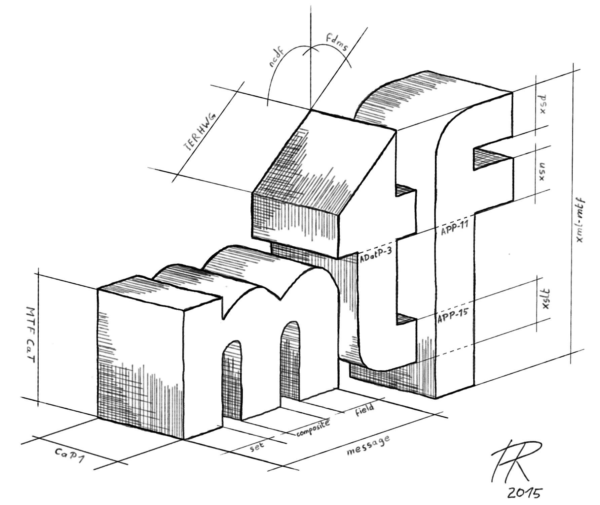

# MTFXML

This project supports collaborative development, configuration management and implementation of United States and NATO Message Text Format (MTF) military standards using the Extensible Markup Language and Web technologies.

Detailed informration and resources are available at:

https://github.com/mil-oss/MTFXML/wiki/MTFXML-DEVELOPMENT-PAGE
